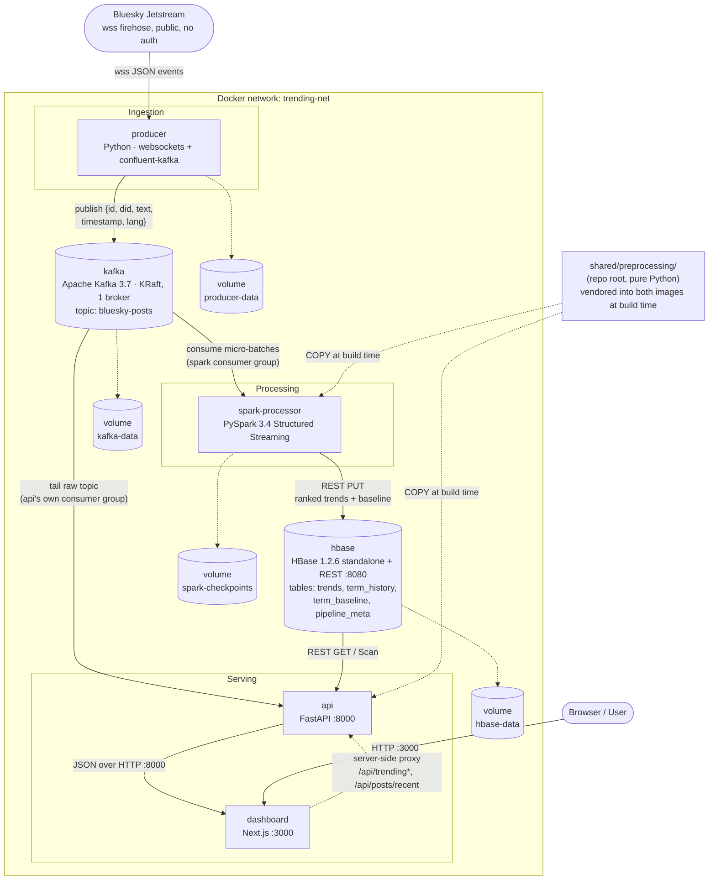

# System architecture

Static view of every service, the Docker network that connects them, and
where each one persists state. See [`flowchart.md`](flowchart.md) for the
step-by-step processing logic, [`sequence-diagram.md`](sequence-diagram.md)
for the request/response timing between services, and
[`preprocessing.md`](preprocessing.md) for the shared cleaning module shown
below as `PREP`.

## Notes

- **Solid arrows** are the live data path; **dashed arrows** are
  proxying/persistence relationships.
- `dashboard` never talks to `api` from the browser directly - its own
  Next.js route handlers (`/api/trending`, `/api/trending/history`,
  `/api/posts/recent`) proxy server-side to `api` over the docker network,
  so only `dashboard`'s port needs to be public.
- `kafka` runs in KRaft mode (no Zookeeper container). `hbase` runs in
  standalone mode, which starts an embedded Zookeeper inside its own
  container - neither needs a separate coordination service here.
- `api` and `spark-processor` both talk to HBase over its REST gateway
  (port 8080) instead of the HBase Java client, so no Hadoop/HBase jars
  need to ship inside the Spark image.
- `api` reads `kafka` twice over: once as the source for `/trending`'s
  upstream data (indirectly, via what Spark writes to HBase) and once
  directly, tailing the raw topic for the `/live` and `/preprocessing`
  pages' post feed. The two consumers are independent - same topic,
  different consumer groups.
- `PREP` is source code, not a running service - `spark-processor` and
  `api` each get their own copy baked into their image at build time (see
  [`preprocessing.md`](preprocessing.md)). They don't call each other or a
  shared process for this; they just both started from the same file.
