# Application flowchart

Step-by-step logic from a single Jetstream event to it appearing (or not)
on the dashboard. See [`architecture.md`](architecture.md) for which
service owns each stage and [`sequence-diagram.md`](sequence-diagram.md)
for the timing between services.

```mermaid
flowchart TD
    START(["Jetstream message arrives<br/>(producer)"]) --> CHK1{"kind == commit AND<br/>operation == create AND<br/>collection == app.bsky.feed.post?"}
    CHK1 -->|No| DROP1(["discard"])
    CHK1 -->|Yes| CHK2{"text non-empty AND<br/>lang in LANG_FILTER?"}
    CHK2 -->|No| DROP2(["discard"])
    CHK2 -->|Yes| MAP["build record<br/>{id, did, text, timestamp, lang}"]
    MAP --> PUB["publish to Kafka topic<br/>bluesky-posts"]
    PUB --> BUF[("Kafka buffers events")]

    BUF --> LIVEC["api's live-feed consumer<br/>(separate consumer group,<br/>starts at latest offset)"]
    LIVEC --> LIVEBUF[("in-memory ring buffer<br/>last N posts")]
    LIVEBUF --> LIVEPOLL["dashboard /live page polls<br/>GET /api/posts/recent every 2s"]
    LIVEPOLL --> LIVERENDER["render post cards<br/>(hashtags highlighted)"]

    BUF --> READ["spark-processor reads<br/>micro-batch from Kafka"]
    READ --> PARSE["parse JSON, drop nulls,<br/>parse timestamp"]
    PARSE --> CLEAN["clean text: strip URLs,<br/>bare domains, mentions,<br/>apostrophes, punctuation"]
    CLEAN --> SPLIT{"hashtag token<br/>(#word) or plain word?"}
    SPLIT -->|hashtag| HASH["keep as #term"]
    SPLIT -->|word| STOP{"length >= MIN_TERM_LENGTH<br/>and not a stopword?"}
    STOP -->|No| DROP3(["discard token"])
    STOP -->|Yes| WORD["keep as term"]
    HASH --> UNION["union into term stream"]
    WORD --> UNION

    UNION --> AGG["group by 5-min window<br/>(1-min slide) + term:<br/>count, distinct authors<br/>(2-min watermark)"]
    AGG --> CHK3{"count >= MIN_COUNT_THRESHOLD<br/>AND distinct_authors >= MIN_DISTINCT_AUTHORS?"}
    CHK3 -->|No| DROP4(["drop candidate"])
    CHK3 -->|Yes| BASE["fetch term's baseline avg<br/>from HBase term_baseline"]
    BASE --> SCORE["score = count / (baseline_avg + smoothing)"]
    SCORE --> RANK["rank candidates by score,<br/>keep top N"]
    RANK --> WRITE1["write trends table<br/>row key: bucket#rank"]
    RANK --> WRITE2["write term_history table<br/>row key: term#bucket"]
    SCORE --> EMA["update baseline (EMA)<br/>in term_baseline table"]
    WRITE1 --> META["update pipeline_meta<br/>latest_bucket pointer"]

    META --> POLL["dashboard polls<br/>GET /api/trending every 30s"]
    POLL --> APIREAD["api reads latest_bucket,<br/>scans trends table for that bucket"]
    APIREAD --> RENDER["dashboard renders<br/>ranked TrendList"]

    RENDER --> CLICK["user clicks a term"]
    CLICK --> HISTREQ["dashboard fetches<br/>GET /trending/history?term=..."]
    HISTREQ --> HISTSCAN["api scans term_history<br/>by term# prefix"]
    HISTSCAN --> SPARKLINE["render Sparkline +<br/>history table"]
```

## Reading this diagram

- The first block (`START` → `BUF`) is the **producer**: every raw
  Jetstream event either gets dropped by a filter or turned into a Kafka
  record.
- The middle block (`READ` → `META`) is the **spark-processor**: one pass
  per micro-batch trigger (every ~30s), cleaning and scoring whatever
  windows the watermark just closed.
- The `LIVEC` → `LIVERENDER` branch is the **live posts feed**: a second,
  independent reader of the same Kafka topic, completely separate from the
  trend-scoring path - it never touches HBase or Spark.
- The last block (`POLL` → `SPARKLINE`) is the **trending read path**: the
  dashboard never touches HBase directly, only the API does.
