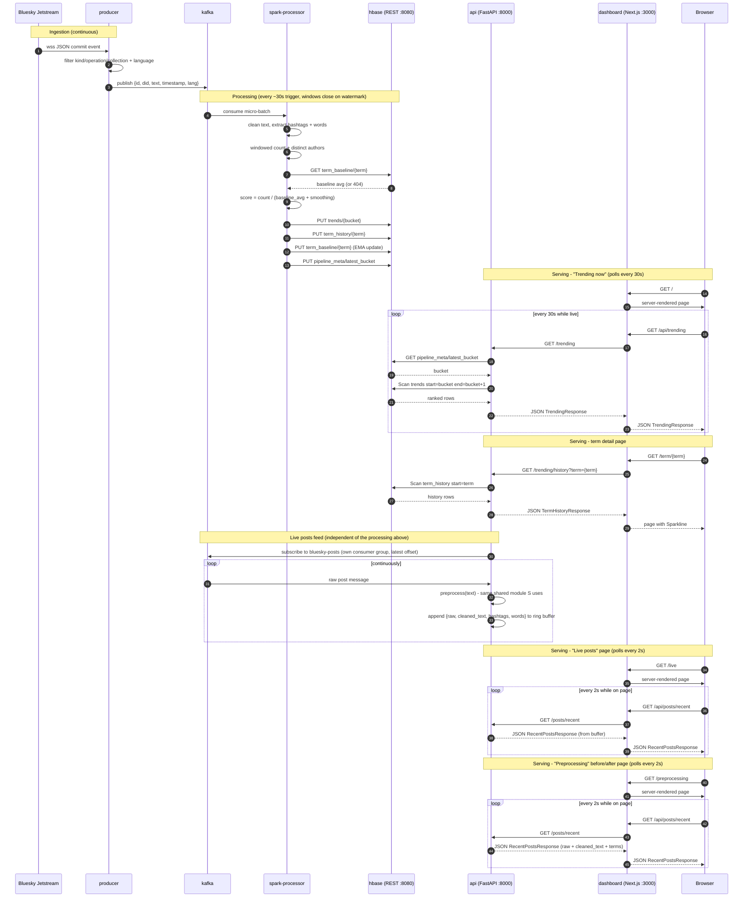

# Sequence diagram

Who calls whom, in order, across one full ingest-to-display cycle. See
[`components.md`](components.md) for what each participant below actually
does in prose, [`architecture.md`](architecture.md) for the static
topology, [`flowchart.md`](flowchart.md) for the decision logic inside
each step, and [`preprocessing.md`](preprocessing.md) for what
`preprocess()` actually does.

## Reading this diagram

- The first two `Note` blocks happen independently and continuously - the
  producer never waits for Spark, and Spark never waits for a dashboard
  request.
- The dashboard's home page is a client component that polls
  `/api/trending` (its own Next.js route handler) rather than calling
  `api` directly; the route handler is the only thing that knows `api`'s
  internal address.
- The term detail page (`/term/{term}`) is server-rendered, so it calls
  `api` directly during the server-side render instead of going through
  the proxy route.
- The live posts feed has its own always-on consume loop inside `api`,
  completely decoupled from the request/response cycle - a page poll just
  reads whatever is currently in the buffer, it never blocks on Kafka.
- `/live` and `/preprocessing` poll the exact same endpoint and buffer -
  they just render different fields of the same `PostItem`. There's no
  separate "preprocessing" service or extra Kafka read for that page.
